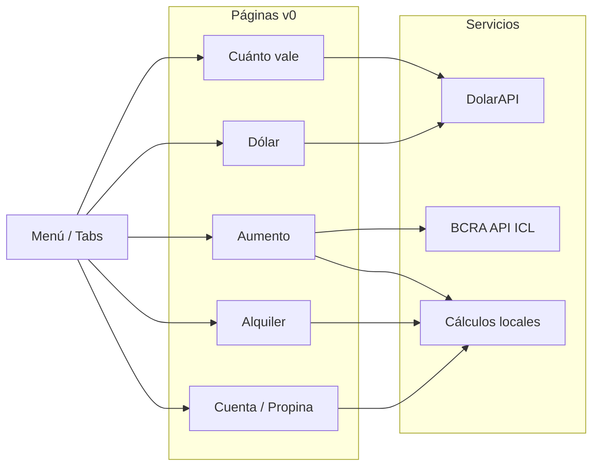

# Plan: Al Día – Desarrollo v0 (web) y preparación para app

Documento de referencia del plan para la app **Al Día** (dinero día a día). Actualizado con decisiones de APIs (DolarAPI, BCRA) y sin base de datos en v0.

---

## Contexto

- **Producto:** Al Día — herramientas cotidianas: dólar (blue/MEP/CCL/oficial), "cuánto vale en pesos", dividir cuenta, propina, alquiler (máximo a pagar, aumento ICL/IPC), costo real del mes.
- **Ubicación:** `c:\Repos\Brainstorming\AlDia\` (nuevo proyecto en root del repo).
- **Stack (según TECNOLOGIA-Y-HOSTING.md):** React + Ionic + Capacitor; hosting Firebase. v0 solo web, sin auth; código preparado para empaquetar como app después.

---

## 1. Pre-requisitos y decisiones ya tomadas

- **Proyecto Firebase:** Ya creado. Nombre: **AlDia** | ID: **aldia-ee57e** | Número: 372925065134. Hosting configurado; dominio temporal (ej. `aldia-ee57e.web.app`) por ahora.
- **API de cotizaciones:** [DolarAPI.com](https://dolarapi.com/docs/argentina/) — Base URL `https://dolarapi.com`. Endpoints: todos los dólares, Blue, Bolsa (MEP), CCL, Oficial, Tarjeta. Sin API key; llamadas desde el frontend (verificar CORS).
- **Índices ICL / IPC / CCP:** [API pública del BCRA](https://principales-variables.bcra.apidocs.ar/). ICL = serie **7988**: `GET https://api.bcra.gob.ar/estadisticas/v4.0/Monetarias/7988` (params opcionales: `desde`, `hasta`, `limit`). Sin API key. **Sin base de datos:** se obtienen desde el frontend al usar la calculadora de aumento, con **cache en el cliente** (memoria o localStorage, ej. 24 h) para no abusar de la API. Si la API falla, fallback con JSON estático en el repo (valores últimos conocidos).
- **Backend:** **No.** v0 es 100% frontend: DolarAPI + BCRA desde el navegador, cache en cliente, resto de cálculos en cliente. Firebase solo para Hosting; sin Firestore en v0.
- **SDK de Firebase en el código:** Opcional para v0. Para subir a Hosting no es necesario; si querés Analytics desde el primer deploy, se puede agregar `firebaseConfig` + `initializeApp` + `getAnalytics`. Si no, se deja para cuando sumes Analytics o Auth.

---

## 2. Estructura del proyecto (AlDia/)

Inicializar en **AlDia/** un proyecto que sea desde el día uno **web + preparado para app**:

- **React** (Vite recomendado para rapidez y buen soporte con Ionic).
- **Ionic React** (componentes de UI que se ven bien en web y luego en app).
- **Capacitor** (añadido al proyecto pero sin configurar targets iOS/Android hasta después del v0 web; solo estructura y `capacitor.config` básico).

Estructura de carpetas sugerida:

```
AlDia/
├── public/
├── src/
│   ├── components/     # componentes reutilizables (inputs, cards, botones compartidos)
│   ├── pages/          # una página por herramienta (Dolar, CuantoVale, CuentaPropina, Alquiler, AumentoAlquiler)
│   ├── hooks/          # useCotizacion, useCuenta, etc.
│   ├── services/       # fetch cotizaciones (API), cálculos puros
│   ├── types/
│   ├── App.tsx
│   └── main.tsx
├── capacitor.config.ts
├── package.json
└── ...
```

- **Rutas:** React Router con rutas por herramienta (`/`, `/dolar`, `/cuanto-vale`, `/cuenta`, `/alquiler`, `/aumento-alquiler`) para SEO y links compartibles.
- **Sin auth en v0:** Todo el estado en memoria o en la URL (query params) para "compartir link" de cuenta/propina; sin Firebase Auth ni Firestore en esta fase.

---

## 3. Funcionalidades v0 (prioridad de implementación)

| Orden | Módulo                          | Descripción breve                                                                                                                                                                                                                                                         |
| ----- | ------------------------------- | ------------------------------------------------------------------------------------------------------------------------------------------------------------------------------------------------------------------------------------------------------------------------- |
| 1     | **Cotizador dólar**             | Selector de tipo (blue, MEP, CCL, oficial). Input ARS o USD → conversión al instante. Fuente: DolarAPI o fallback manual. Opcional v0: "cuánto me queda en mano si cobro en USD" (restar impuestos/comisión).                                                              |
| 2     | **Cuánto vale en pesos**        | Mismo motor de conversión: precio en USD → equivalente en blue, MEP o "con impuesto tarjeta" (ej. +30% o el que aplique). Ideal misma página o subruta que use el mismo servicio de cotizaciones.                                                                         |
| 3     | **Dividir cuenta + propina**    | Una pantalla con dos "modos" (tabs o toggle): (A) Dividir cuenta en pesos — "cada uno lo suyo" o partes iguales; (B) Propina — % sobre total (10%, 15%, etc.). Resultado compartible por URL (query params) para que otros vean "cuánto toca".                            |
| 4     | **Calculadora de alquiler**     | Ingresos + % que podés destinar al alquiler → "máximo que podés pagar" y "cuánto te queda por mes". Moneda según preferencia (pesos/dólar).                                                                                                                               |
| 5     | **Calculadora próximo aumento** | Monto actual + fecha de contrato + tipo de índice (ICL, IPC, CCP). Cálculo "próximo aumento sería aproximadamente X". Índices: **API BCRA** (ICL = serie 7988); fetch al cargar la pantalla con cache en cliente (24 h); sin BD. Fallback: JSON estático si la API falla. |

Requisito v0: **navegación por menú o pestañas** (Ionic tabs o lista en layout) para saltar entre herramientas. Sin login.

---

## 4. Datos y servicios

- **Cotizaciones:** Servicio en `src/services/cotizacion.ts` (o similar) que llame a DolarAPI y exponga blue, MEP, CCL, oficial. Un hook `useCotizacion` para que las páginas consuman y muestren "actualizado hace X min". Cache breve (ej. 5–10 min) en cliente.
- **Índices alquiler (ICL, y otros si aplica):** Servicio en `src/services/indicesBcra.ts` (o similar) que llame a `https://api.bcra.gob.ar/estadisticas/v4.0/Monetarias/7988` para ICL; fetch cuando el usuario entra a la calculadora de aumento; **cache en cliente** (ej. 24 h en memoria o localStorage) para no golpear la API en cada visita. Opcional: JSON estático en `src/data/` como fallback si la API del BCRA falla o CORS lo impide. Sin Firestore ni otra BD.
- **Dividir cuenta / propina:** Sin persistencia; estado en React + serialización a query params para "compartir link". Quien abre el link ve el mismo total, partes y propina.

---

## 5. UI/UX y SEO

- **Ionic:** Usar componentes Ionic (inputs, cards, botones, tabs) para que en web se vea bien y luego en app sea consistente.
- **Responsive:** Que funcione bien en móvil y desktop (Ionic ya ayuda).
- **SEO:** Títulos y meta description por ruta ("Dólar blue hoy – Al Día", "Dividir cuenta – Al Día", etc.). Estructura de headings (h1 por página). Si se usa Vite, considerar un plugin o layout para meta tags por ruta; si no, al menos un `<title>` y descripción por página.
- **Compartir:** En "dividir cuenta" y "propina", botón "Compartir" que copie la URL con los params al portapapeles (y opcionalmente texto para WhatsApp).

---

## 6. Hosting y deploy (v0)

- **Build:** `npm run build` genera la SPA en `dist/` (o la carpeta que use Vite).
- **Firebase Hosting:** `firebase init hosting` en AlDia apuntando al proyecto `aldia-ee57e`; public directory = carpeta de build de Vite. Deploy con `firebase deploy`.
- **Alternativa solo web:** Si preferís no usar Firebase aún, se puede usar Vercel o Netlify con el mismo build; el plan de tecnología igual deja preparado Capacitor para cuando quieras app.

---

## 7. Preparación para app (sin implementar en v0)

- **Capacitor:** Tener `capacitor.config.ts` con `appId` y `appName` ("Al Día"). No hace falta correr `cap add ios/android` hasta después del v0 web.
- **Estructura:** Evitar dependencias web-only que rompan en app (ej. asumir que las rutas y el manejo de URLs compartidas funcionen también en app con deep links más adelante).
- **Documentación:** Un breve README en AlDia indicando: "v0 = web; para compilar app: `npx cap add ios` / `android`, luego `build` y `cap sync`".

---

## 8. Orden sugerido de tareas

1. Crear proyecto React + Vite en `AlDia/`, instalar Ionic y Capacitor; configurar React Router y estructura de carpetas.
2. Configurar Firebase Hosting (proyecto `aldia-ee57e`) y script de deploy.
3. Implementar servicio de cotizaciones + hook y página **Cotizador dólar**.
4. Implementar página **Cuánto vale en pesos** (reutilizando servicio).
5. Implementar **Dividir cuenta + propina** (una página, dos modos) con URL compartible.
6. Implementar **Calculadora de alquiler** (máximo a pagar / cuánto queda).
7. Implementar **Calculadora próximo aumento** (ICL desde API BCRA serie 7988, cache en cliente; fallback JSON estático si falla).
8. Ajustar navegación (tabs o menú), títulos y meta tags por ruta para SEO.
9. Probar build y primer deploy en Firebase Hosting (o Vercel/Netlify).
10. README con instrucciones v0 y pasos futuros para generar app con Capacitor.

---

## 9. Lo que no va en v0 (queda para después)

- Auth y guardado de historial (versión "pro").
- Export PDF.
- Afiliados (enlaces a brokers, envíos internacionales): se pueden dejar placeholders o enlaces fijos.
- Expensas + alquiler ("costo real del mes"): se puede añadir como extensión de la calculadora de alquiler en una iteración posterior.

---

## Diagrama de flujo v0 (alto nivel)



---

## Resumen

- **Firebase:** Proyecto AlDia (`aldia-ee57e`) creado; Hosting listo. Dominio temporal por ahora.
- **Cotizaciones:** DolarAPI. **Índices alquiler:** API pública BCRA (ICL serie 7988), cache en cliente, sin BD. **Backend:** no en v0.
- No hace falta nada más de tu parte para arrancar el desarrollo. Cuando implementemos, en AlDia usaremos `.firebaserc` con project `aldia-ee57e` y, si querés Analytics desde el primer deploy, agregamos el `firebaseConfig` que te generó la consola.
